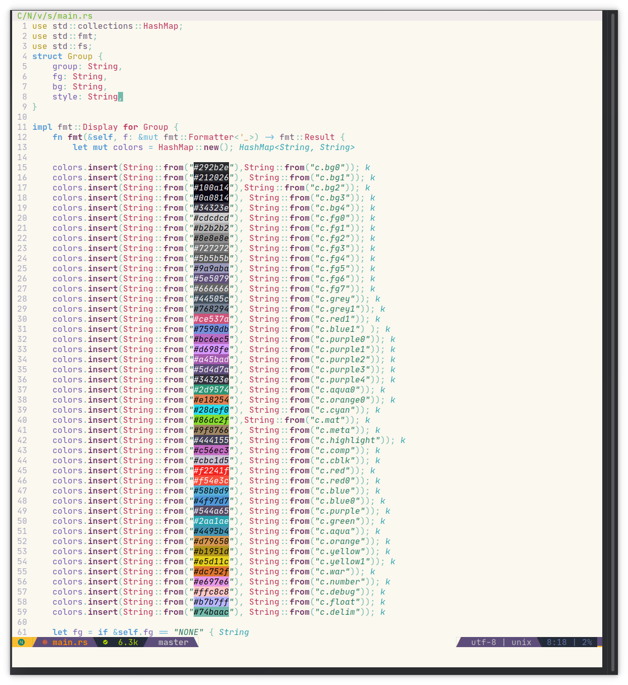

# Space Neovim Theme

A spacemacs inspired dark and light colorscheme for neovim.

## Screenshots

Dark theme


Light theme



*Font:* Jet Brains Mono
*Statusline:* [Spaceline](https://github.com/glepnir/spaceline.vim)
*RGB Highlightin:* [nvim-colorizer.](https://github.com/norcalli/nvim-colorizer.lua)
*Minimap:* [minimap.vim](https://github.com/wfxr/minimap.vim)

## Prerequisites

1. Neovim 0.5+

### Installation

#### Vim Plug

```vim
Plug 'Th3Whit3Wolf/space-nvim'

" And then somewhere in your init.vim, to set the colorscheme
colorscheme space-nvim
```

#### Minpac

```vim
call minpac#add('Th3Whit3Wolf/space-nvim')

" And then somewhere in your init.vim, to set the colorscheme
colorscheme space-nvim
```

#### Vim Packages

In the terminal execute this command.

```sh
cd ~/.local/share/nvim/site/pack/opt/
git clone https://github.com/Th3Whit3Wolf/space-nvim
```

In your `init.vim` add the following

```vim
packadd! space-nvim
```

```vim
colorscheme space-nvim
```

### Transparent background

###### Require terminal with transparent background

```lua
vim.g.space_nvim_transparent_bg = true
```
### NOTE

- Vim is not supported because the theme is written in lua.
- If you feel like a language should be highlighted differently please open an issue.

### TODO

- [ ] Better Tree Sitter Highlighting

## Special Thanks To

- [Kiyan Yazdani](https://github.com/kyazdani42) who's [nvim-palenight.lua](https://github.com/kyazdani42/nvim-palenight.lua) was my template for the lua in this theme.
- [Josh Dick](https://github.com/joshdick) who's excellently commented [onedark.vim](https://github.com/joshdick/onedark.vim) I stole 99% of this themes comments from(I actually looked at the docs for nvim-treesitter).
- [Liu-Cheng Xu](https://github.com/liuchengxu) who's [space-vim-theme](https://github.com/liuchengxu/space-vim-theme) where I got all of my highlighting from
